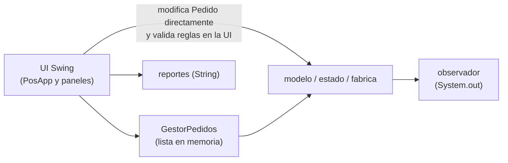
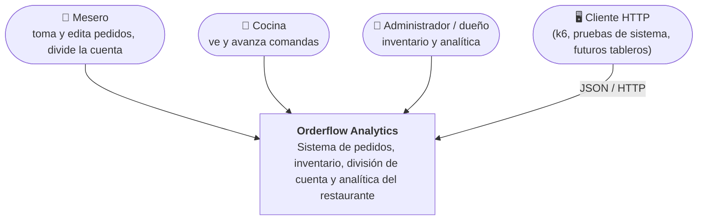
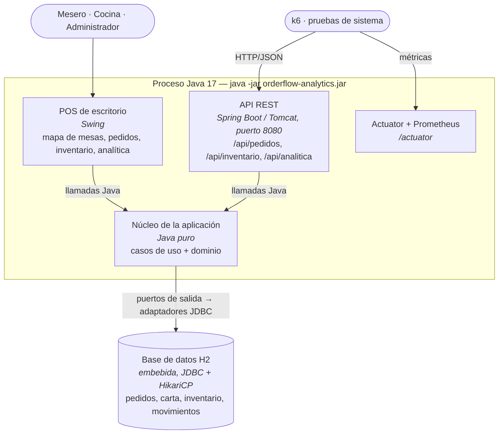
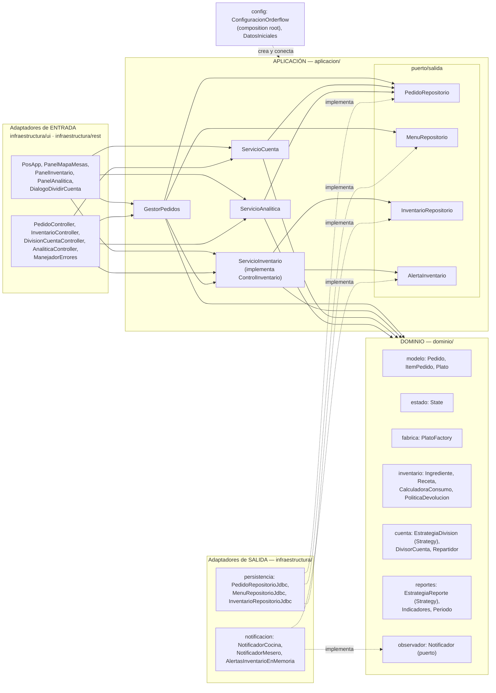

# Documento de arquitectura — Orderflow Analytics (Corte 2)

> Diseño y Arquitectura de Software (DYAS) · Universidad de La Sabana
> Integrantes: Federico Valdez, Daniel Sanabria

Contenido

1. [Descripción del sistema y resumen del Corte 1](#1-descripción-del-sistema-y-resumen-del-corte-1)
2. [Retos asignados y tabla de trazabilidad](#2-retos-asignados-y-tabla-de-trazabilidad)
3. [Comparación de estilos y decisión (ADR)](#3-comparación-de-estilos-y-decisión)
4. [Arquitectura inicial (Corte 1) y evolucionada (Corte 2)](#4-arquitectura-inicial-corte-1-y-evolucionada-corte-2)
5. [Estrategia de pruebas](#5-estrategia-de-pruebas)
6. [Resultados de las pruebas](#6-resultados-de-las-pruebas)
7. [Límites conocidos y trabajo para el Corte 3](#7-límites-conocidos-y-trabajo-para-el-corte-3)

---

## 1. Descripción del sistema y resumen del Corte 1

**Problema.** En un restaurante que trabaja con papel y voz, las comandas se pierden o se duplican,
nadie sabe cuánto tarda un pedido y el dueño decide el menú "a ojo".

**Corte 1 (entregado).** Un módulo de gestión de pedidos en Java con principios SOLID y cuatro
patrones:

| Patrón | Dónde (Corte 1) | Para qué |
|---|---|---|
| Factory Method | `PlatoFactory` | Crear platos por categoría con su tiempo de preparación |
| State | `EstadoPedido` + 4 estados (+ `EstadoCancelado`) | Flujo Creado → En preparación → Listo → Entregado |
| Observer | `Notificador`, `NotificadorCocina`, `NotificadorMesero` | Avisar a cocina y mesero en cada cambio |
| Strategy | `EstrategiaReporte` + 3 reportes | Platos más/menos pedidos, tiempo promedio |

Tenía una UI Swing (mapa de mesas, lista, notificaciones, analítica en texto), **todo en memoria**
y un único proceso. La propia documentación del Corte 1 declaraba dos límites: sin persistencia y
sin concurrencia real.

**Corte 2 (este entregable).** El mismo dominio, reorganizado en **arquitectura hexagonal**, con
persistencia en H2, una API REST además de la UI de escritorio, los tres retos resueltos
(inventario, división de cuenta, analítica con gráficas) y pruebas unitarias, de integración y de
carga.

---

## 2. Retos asignados y tabla de trazabilidad

Retos recibidos en el Corte 1:

| # | Reto (enunciado del profesor) | Qué exige en términos del sistema |
|---|---|---|
| R1 | "Manejar un apartado de inventario para tener trazabilidad de los ingredientes" | Cada plato vendido debe descontar sus ingredientes; no se puede vender lo que no hay; todo cambio de stock debe quedar registrado con su causa (venta, devolución, merma, compra, ajuste) y el pedido que lo originó. Con varios meseros a la vez, el stock no puede quedar inconsistente. |
| R2 | "Si son varias personas, que la cuenta pueda dividirse al gusto de las personas" | Dividir un mismo pedido de varias formas (iguales, por lo que consumió cada uno con platos compartidos, por porcentaje), con propina opcional, y que las partes sumen **exactamente** el total. Debe poder agregarse otra forma de dividir sin reescribir las existentes. |
| R3 | "Que la analítica se vea mejor, que muestre gráficas, más completa" | Pasar de reportes en texto a indicadores y gráficas; más reportes (horas pico, categorías, tiempos por etapa); filtrables por periodo; y disponibles también para otros clientes (API). |
| R0 | Límites declarados en Corte 1: sin persistencia, un solo usuario | Los datos deben sobrevivir y el sistema debe atender a varios meseros (y clientes HTTP) al mismo tiempo. Es la base técnica que R1 y la prueba de carga necesitan. |

La tabla de trazabilidad completa (reto → atributo → decisión → dónde → prueba → resultado) está en
el [README](../README.md#tabla-de-trazabilidad) para que sea lo primero que se vea.

**Funcionalidad nueva agregada.** El enunciado solo permite agregar funcionalidad cuando un reto lo
exige: inventario (R1), división de cuenta (R2) y los nuevos reportes/KPI (R3) están en esa
situación y están marcados en la tabla de trazabilidad. La API REST no es funcionalidad de negocio
nueva: es un segundo adaptador de entrada sobre los mismos casos de uso (lo necesitan las pruebas de
caja negra y de carga).

---

## 3. Comparación de estilos y decisión

### 3.1 Criterios (derivados de los retos)

| Criterio | Viene de | Atributo de calidad |
|---|---|---|
| K1. Agregar formas de dividir, reportes o canales sin tocar lo existente | R2, R3 | Modificabilidad / extensibilidad |
| K2. Varios adaptadores de entrada (POS Swing, API REST, k6) con **las mismas reglas** | R0, R3 | Mantenibilidad (no duplicar reglas) |
| K3. Probar reglas de negocio aisladas (reparto al peso, política de devolución, stock) | R1, R2 | Testabilidad |
| K4. Consistencia del inventario con pedidos concurrentes | R1, R0 | Integridad de datos / confiabilidad |
| K5. Cambiar la tecnología de persistencia (H2 → PostgreSQL) sin tocar el negocio | R0 | Portabilidad / modificabilidad |
| K6. Proporcional al tamaño real: 2 personas, un restaurante, un despliegue | Enunciado | Simplicidad / costo |

### 3.2 Matriz de estilos candidatos (1 = malo, 5 = muy bueno)

| Criterio | Capas (3 niveles) | **Hexagonal / limpia** (monolito) | Microservicios (pedidos, inventario, analítica) | Orientada a eventos |
|---|---|---|---|---|
| K1 Extensibilidad | 3 — posible, pero la lógica tiende a filtrarse al controlador | **5** — Strategy en el dominio + adaptadores nuevos | 4 | 4 — nuevos consumidores de eventos |
| K2 Varios adaptadores, mismas reglas | 3 — la capa de presentación suele ser una sola | **5** — es exactamente el caso de uso de puertos de entrada | 4 | 3 |
| K3 Testabilidad aislada | 3 — el servicio depende del DAO concreto | **5** — el núcleo no depende de nada; mocks de puertos | 4 por servicio, 2 extremo a extremo | 2 — flujos asíncronos difíciles de probar |
| K4 Consistencia del inventario | 4 — una BD, transacción local | **4** — una BD, transacción local en el adaptador | **1** — pedido e inventario en BD distintas: requiere sagas / compensaciones distribuidas | 2 — consistencia eventual; vender el último huevo dos veces es posible |
| K5 Cambiar persistencia | 3 — la capa de datos se cambia, pero el servicio suele conocer el DAO | **5** — nuevo adaptador del mismo puerto | 4 | 3 |
| K6 Proporcionalidad | **5** | 4 — algunas clases más (puertos) | **1** — 3 despliegues, red, descubrimiento, trazas distribuidas para 2 desarrolladores | 2 — requiere broker |
| **Total** | 21 | **28** | 18 | 16 |

### 3.3 Decisión

Se eligió **arquitectura hexagonal (puertos y adaptadores) en un solo despliegue** — un "monolito
bien modularizado". Queda registrada en
[ADR-001](adr/ADR-001-arquitectura-hexagonal.md). Decisiones que se derivan de ella:

- [ADR-002](adr/ADR-002-persistencia-jdbc-h2-pool.md) — persistencia con JDBC plano sobre H2 y pool HikariCP.
- [ADR-003](adr/ADR-003-consistencia-inventario.md) — cómo se garantiza que el inventario no se sobrevenda con pedidos concurrentes.

**Qué se gana:** reglas en un solo lugar para Swing, REST y pruebas; núcleo probado sin base de
datos; persistencia reemplazable; los retos se resuelven agregando clases (estrategias, adaptadores),
no editando las existentes.

**Qué se sacrifica:** más clases e indirección (puertos, DTOs, composition root); un solo despliegue
escala solo verticalmente; la consistencia entre pedido e inventario se resuelve con una
compensación en el caso de uso (no hay una única transacción que abarque ambos, ver §7).

**Por qué no microservicios:** ningún reto exige escalar o desplegar partes por separado, y R1 (no
sobrevender) es mucho más difícil con pedidos e inventario en bases distintas. Sería una mala
decisión aunque estuviera bien implementada (lo advierte el enunciado).

**Qué se tomó de otros estilos:** de capas, la idea de que el adaptador REST solo traduce; de
eventos, el patrón Observer interno (notificadores y alertas de stock) — dentro del proceso, sin
broker.

---

## 4. Arquitectura inicial (Corte 1) y evolucionada (Corte 2)

### 4.1 Corte 1 — antes

Problemas que motivaron el cambio: la UI cambiaba objetos del dominio y repetía reglas (no quitar
el último plato, no cancelar un pedido terminado); no había persistencia ni forma de exponer el
sistema a otro cliente; los reportes devolvían texto, imposible de graficar.

### 4.2 Corte 2 — Diagrama de contexto (C4 nivel 1)

### 4.3 Diagrama de contenedores (C4 nivel 2)

H2 corre dentro del mismo proceso (modo embebido). Por eso es un contenedor lógico distinto
(esquema, transacciones) pero no un despliegue separado; cambiarlo por PostgreSQL es cambiar la URL
y el driver (ADR-002).

### 4.4 Diagrama de componentes (C4 nivel 3) — la hexagonal

**Regla del estilo:** las flechas de dependencia apuntan hacia adentro. `dominio` no importa nada de
`aplicacion` ni de `infraestructura` (ni Spring, JDBC o Swing); `aplicacion` no importa
`infraestructura`. Lo verifica automáticamente
[`ReglasDeDependenciaTest`](../src/test/java/com/restaurant/arquitectura/ReglasDeDependenciaTest.java):
si alguien rompe la regla, el build falla. Spring solo aparece en `infraestructura` (y en
`OrderflowApplication`); el núcleo se construye con `new` en `ConfiguracionOrderflow`.

### 4.5 Correspondencia con el código

| Componente | Paquete | Estilo / patrón |
|---|---|---|
| Entidades y reglas | `com.restaurant.dominio.*` | Núcleo hexagonal; State, Factory Method, Strategy (x2), Observer |
| Casos de uso | `com.restaurant.aplicacion.casodeuso` | Servicios de aplicación |
| Puertos de salida | `com.restaurant.aplicacion.puerto.salida` + `dominio.observador.Notificador` | Puertos |
| Adaptadores de entrada | `com.restaurant.infraestructura.ui`, `...rest` | Adaptadores primarios |
| Adaptadores de salida | `com.restaurant.infraestructura.persistencia`, `...notificacion` | Adaptadores secundarios |
| Ensamblado | `com.restaurant.infraestructura.config`, `OrderflowApplication` | Composition root |

Diagrama de clases del dominio: [`diagramas/clases-dominio.md`](diagramas/clases-dominio.md).
Secuencia "tomar un pedido con inventario": [`diagramas/secuencia-crear-pedido.md`](diagramas/secuencia-crear-pedido.md).

---

## 5. Estrategia de pruebas

Resumen (el detalle, con cada clase de prueba y su propósito, está en [`pruebas.md`](pruebas.md)):

| Nivel | Qué se prueba | Por qué ahí | Herramientas | Comando |
|---|---|---|---|---|
| Unitarias | Reglas del dominio y casos de uso, con puertos simulados | Es donde viven las reglas de los retos; rápidas y sin infraestructura | JUnit 5, Mockito, jqwik, JaCoCo | `mvn test` |
| Arquitectura | Que el núcleo no dependa de infraestructura | Evidencia de coherencia estilo ↔ código | JUnit 5 (lectura de imports) | `mvn test` |
| Integración | Adaptador JDBC ↔ H2 real; concurrencia del inventario | La atomicidad y el SQL solo se prueban con la base de datos de verdad | JUnit 5, H2 | `mvn verify` |
| Sistema (caja negra) | Flujos completos por HTTP: pedidos, inventario, división, analítica | Verifica todas las fronteras juntas, como un cliente | Spring Boot Test, TestRestTemplate | `mvn verify` |
| Carga | Flujo del mesero y panel de analítica con muchos usuarios | SLO de los retos bajo concurrencia | k6 | `perf/run-perf.ps1` |

---

## 6. Resultados de las pruebas

Ver [`pruebas.md` §6](pruebas.md#6-resultados) (reportes de Surefire/Failsafe, cobertura JaCoCo y
análisis de carga).

---

## 7. Límites conocidos y trabajo para el Corte 3

| Límite | Consecuencia | Qué haría falta |
|---|---|---|
| Pedido e inventario no comparten una transacción. El caso de uso descuenta inventario y luego guarda el pedido; si el guardado falla, **compensa** devolviendo lo descontado. | Si el proceso muere justo entre las dos operaciones, queda stock descontado sin pedido (se detecta en el historial: SALIDA_VENTA de un pedido inexistente). | Un puerto de "unidad de trabajo" que abra una transacción compartida por ambos adaptadores. |
| Los candados por pedido/mesa de `GestorPedidos` viven en memoria. | Correctos con una instancia; con varias instancias de la app detrás de un balanceador no protegen. (El inventario sí es seguro entre instancias: lo protege la base de datos.) | Bloqueo optimista con columna `version` en `pedido`. |
| La analítica calcula sobre los pedidos del periodo en cada recálculo (O(n)). En la 1.ª prueba de carga, sin caché, 30 consultas simultáneas con decenas de miles de pedidos **tumbaron el servicio**. | Mitigado con filtro por fecha en SQL y caché de 3 s con un solo cálculo a la vez (el panel puede tener hasta 3 s de retraso). Con "TODO" y un historial muy grande, un recálculo sigue siendo costoso. | CQRS: un modelo de lectura con agregados por hora/plato actualizado al cerrar cada pedido. |
| H2 embebido en memoria por defecto. | Al reiniciar se pierden los datos (existe la URL de archivo en `application.properties`). | Adaptador a PostgreSQL (mismo código JDBC) y prueba con Testcontainers como en el taller de integración. |
| La división de cuenta es una consulta: no registra pagos. | No hay caja ni conciliación. | Módulo de pagos (fuera del alcance de los retos). |
| Sin autenticación ni roles. | Cualquiera con acceso a la API puede ajustar inventario. | Spring Security / API key — parte de DevSecOps en el Corte 3. |
| Pruebas de UI (Selenium/Cypress) no aplican directamente a Swing. | Sin bonificación de UI. | Pruebas de UI sobre un cliente web, o AssertJ-Swing. |

**Corte 3:** el workflow `.github/workflows/ci.yml` ya corre `mvn verify` en cada push; falta
agregar las pruebas de carga como etapa del pipeline, análisis estático y de dependencias
(DevSecOps).
