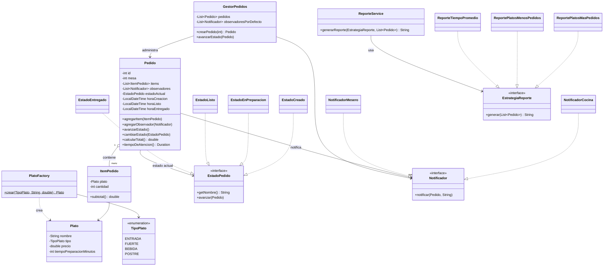

# Diagrama de clases — Sistema de Gestión de Pedidos de Restaurante



> GitHub renderiza bloques ```mermaid``` de forma nativa en Markdown, así
> que este archivo se ve como diagrama directamente en el repositorio
> (Wiki o carpeta `docs/`), sin depender de un servicio externo de
> imágenes que pueda caducar.
