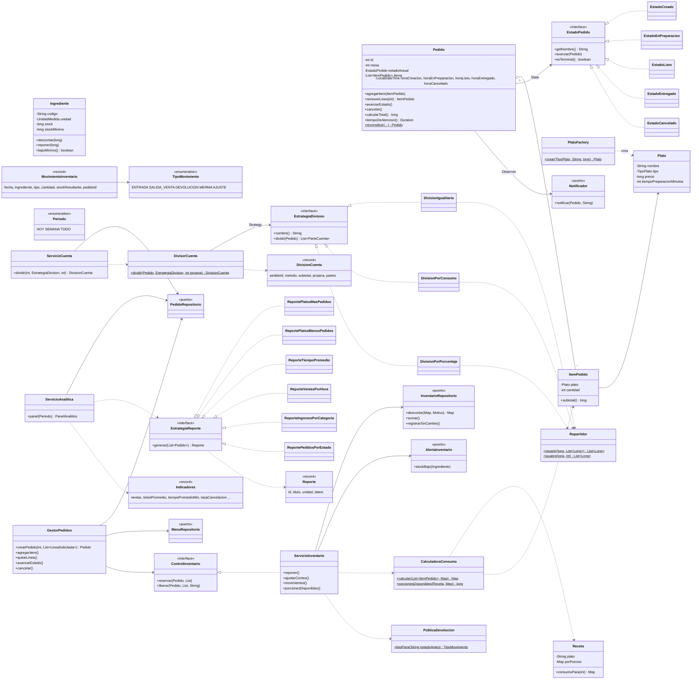

# Diagrama de clases del núcleo — Corte 2

Paquetes `dominio` y `aplicacion` (el núcleo de la hexagonal). Los adaptadores de
`infraestructura` implementan las interfaces marcadas como `<<puerto>>`.

