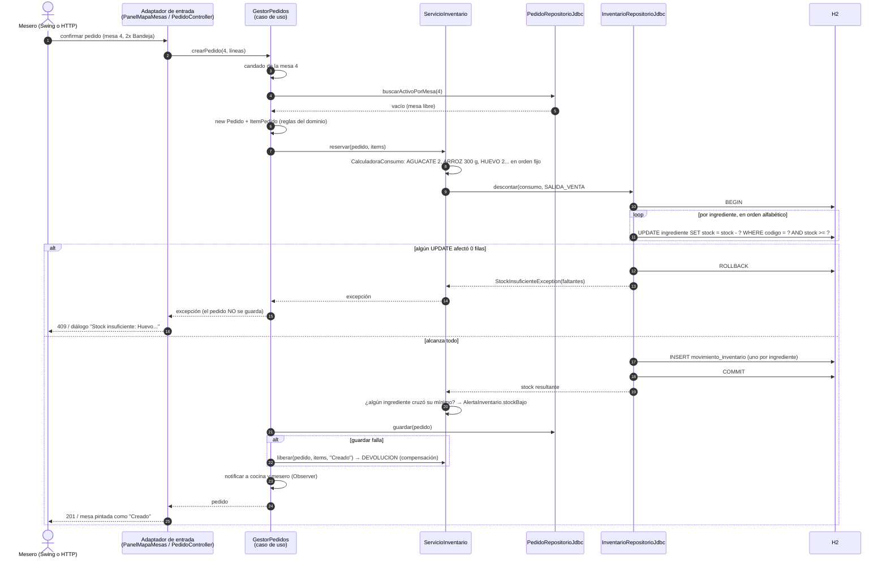

# Secuencia — tomar un pedido con descuento de inventario (Reto 1)

Muestra cómo una petición atraviesa la hexagonal y dónde se garantiza la consistencia.

```mermaid
sequenceDiagram
    autonumber
    actor M as Mesero (Swing o HTTP)
    participant A as Adaptador de entrada<br/>(PanelMapaMesas / PedidoController)
    participant G as GestorPedidos<br/>(caso de uso)
    participant I as ServicioInventario
    participant P as PedidoRepositorioJdbc
    participant R as InventarioRepositorioJdbc
    participant DB as H2

    M->>A: confirmar pedido (mesa 4, 2x Bandeja)
    A->>G: crearPedido(4, líneas)
    G->>G: candado de la mesa 4
    G->>P: buscarActivoPorMesa(4)
    P-->>G: vacío (mesa libre)
    G->>G: new Pedido + ItemPedido (reglas del dominio)
    G->>I: reservar(pedido, items)
    I->>I: CalculadoraConsumo: AGUACATE 2, ARROZ 300 g, HUEVO 2... en orden fijo
    I->>R: descontar(consumo, SALIDA_VENTA #id)
    R->>DB: BEGIN
    loop por ingrediente, en orden alfabético
        R->>DB: UPDATE ingrediente SET stock = stock - ? WHERE codigo = ? AND stock >= ?
    end
    alt algún UPDATE afectó 0 filas
        R->>DB: ROLLBACK
        R-->>I: StockInsuficienteException(faltantes)
        I-->>G: excepción
        G-->>A: excepción (el pedido NO se guarda)
        A-->>M: 409 / diálogo "Stock insuficiente: Huevo..."
    else alcanza todo
        R->>DB: INSERT movimiento_inventario (uno por ingrediente)
        R->>DB: COMMIT
        R-->>I: stock resultante
        I->>I: ¿algún ingrediente cruzó su mínimo? → AlertaInventario.stockBajo
        G->>P: guardar(pedido)
        alt guardar falla
            G->>I: liberar(pedido, items, "Creado") → DEVOLUCION (compensación)
        end
        G->>G: notificar a cocina y mesero (Observer)
        G-->>A: pedido
        A-->>M: 201 / mesa pintada como "Creado"
    end
```
