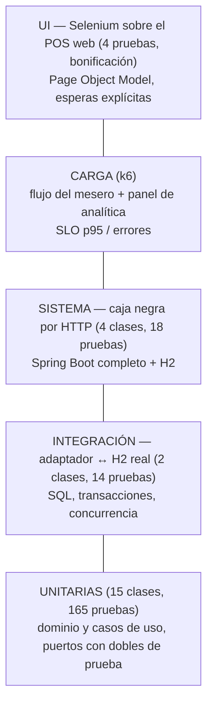
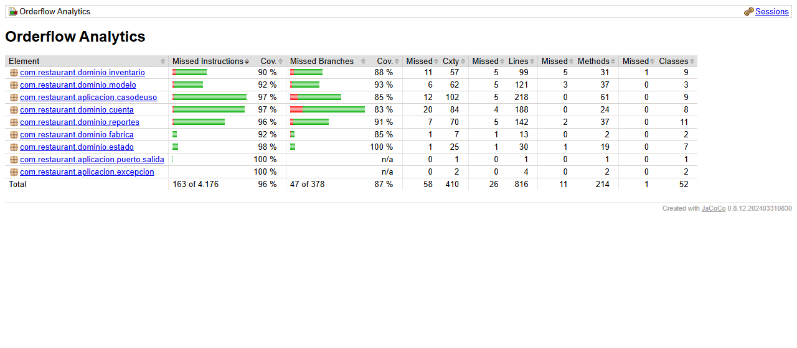

# Estrategia y resultados de pruebas — Corte 2

Todas las pruebas se ejecutan con un comando documentado:

| Qué | Comando | Reporte |
|---|---|---|
| Unitarias + regla de arquitectura + cobertura | `mvn test` | `target/surefire-reports/`, `target/site/jacoco/index.html` |
| Unitarias + integración + sistema (caja negra) | `mvn verify` | además `target/failsafe-reports/` |
| Carga | `powershell -ExecutionPolicy Bypass -File perf\run-perf.ps1` (o `bash perf/run-perf.sh`) | `perf/results/*.md` y `*.json` |
| UI con Selenium (bonificación) | `mvn verify -Pui-tests` | `target/failsafe-reports/` |
| Una sola clase | `mvn -Dtest=DivisionCuentaTest test` · `mvn -Dit.test=ApiInventarioIT verify` | |

Convención (igual que en los talleres): las clases `*Test` son unitarias y las corre Surefire en
`mvn test`; las clases `*IT` son de integración y las corre Failsafe en `mvn verify`. Las `*UiIT`
necesitan un navegador y solo corren con el perfil `ui-tests`.

---

## 1. Qué se prueba en cada nivel y por qué

| Nivel | Frontera de la hexagonal que cubre | Qué NO usa |
|---|---|---|
| Unitarias | Dentro del núcleo (dominio, casos de uso) | Base de datos, Spring, red, Swing |
| Integración | Puerto de salida ↔ adaptador JDBC ↔ base H2 | Spring, HTTP |
| Sistema | Adaptador REST ↔ casos de uso ↔ adaptadores JDBC ↔ H2 (todo junto) | Nada simulado |
| Carga | El sistema desplegado como jar, por HTTP | Nada simulado |
| UI | Navegador → web → REST → núcleo → H2 (aplicación real en puerto aleatorio) | Nada simulado |

---

## 2. Pruebas unitarias

### 2.1 Inventario de clases

| Clase | Reto | Qué verifica | Dobles de prueba |
|---|---|---|---|
| `dominio/modelo/PedidoTest` (22) | base | Creación (límites de id/mesa), ítems, no dejar el pedido vacío, flujo de estados, cancelar, tiempos con reloj falso, notificaciones, reconstitución | `RelojFalso` (stub), `Notificador` (mock) |
| `dominio/modelo/ItemPedidoTest` (10) | base | Cantidad 1..50 (límites 0, 1, 50, 51), subtotal | – |
| `dominio/fabrica/PlatoFactoryTest` (11) | base | Tiempo por categoría, precio ≤ 0, nombre vacío/null, igualdad por nombre | – |
| `dominio/estado/EstadosPedidoTest` (7) | base | Nombre ↔ estado, estados terminales | – |
| `dominio/inventario/IngredienteTest` (17) | R1 | Descontar/reponer, stock exacto (límite), stock + 1, bajo mínimo (3, 4, 5 con mínimo 4), cruce del mínimo | – |
| `dominio/inventario/RecetaYConsumoTest` (9) | R1 | Consumo × porciones, suma de ingredientes compartidos, platos sin receta, orden fijo, porciones disponibles, política de devolución | – |
| `dominio/cuenta/RepartidorTest` (9) | R2 | 100.000 / 3, pesos 2:1, total 0, 1 persona, $1 entre 3, entradas inválidas | – |
| `dominio/cuenta/RepartidorPropiedadesTest` (2 propiedades × 500 casos) | R2 | **Propiedades** (jqwik): para cualquier total y 1..20 personas, las partes suman el total y difieren máximo en $1 | – |
| `dominio/cuenta/DivisionCuentaTest` (17) | R2 | Las tres estrategias, líneas sin asignar o inexistentes, porcentajes 99/101/0, propina 0..20 (límites −1 y 21), pedido cancelado o vacío, estrategia defectuosa detectada | – |
| `dominio/reportes/ReportesTest` (11) | R3 | Cada reporte sobre un escenario fijo, reportes vacíos, KPI, filtro de periodo (límite de 7 días), texto de Corte 1 | `RelojFalso` |
| `aplicacion/casodeuso/GestorPedidosTest` (24) | base, R1 | Mesa 0/1/10/11, mesa ocupada, plato inexistente, avanzar/cancelar terminados, orden reservar→guardar, **no guardar si no hay stock**, compensación si falla el guardado | Mocks de `PedidoRepositorio`, `MenuRepositorio`, `ControlInventario`, `Notificador` |
| `aplicacion/casodeuso/ServicioInventarioTest` (12) | R1 | Qué se descuenta y con qué motivo (captor), alerta solo al cruzar el mínimo, devolución vs merma, reposición, ajuste por conteo | Mocks de `InventarioRepositorio`, `AlertaInventario`; `ArgumentCaptor` |
| `aplicacion/casodeuso/ServicioCuentaTest` (3) | R2 | Pedido existente, inexistente, cancelado | Mock de `PedidoRepositorio` |
| `aplicacion/casodeuso/ServicioAnaliticaTest` (8) | R3 | Panel completo, filtro por periodo en SQL, reporte por id, **caché: vigencia (límite exacto 3 s), 20 usuarios simultáneos → 1 solo cálculo, y 15 usuarios pidiendo HOY/SEMANA/TODO → nunca 2 cálculos a la vez** | Mock de `PedidoRepositorio` + stubs lentos hechos a mano |
| `arquitectura/ReglasDeDependenciaTest` (3) | estilo | `dominio` y `aplicacion` no importan infraestructura, Spring, JDBC ni Swing | – |

**Total: 165 pruebas unitarias** (las parametrizadas cuentan cada caso). Todas siguen **AAA**
(comentarios `// Arrange`, `// Act`, `// Assert` en las que no son de una línea) y usan
`@DisplayName` descriptivo (qué se prueba y qué se espera).

### 2.2 Clases de equivalencia y valores límite (principales)

| Regla | Válidas | Inválidas | Límites probados |
|---|---|---|---|
| Mesa del pedido | 1..N mesas | ≤ 0, > N | 0, 1, 10, 11, −3 |
| Cantidad por línea | 1..50 | ≤ 0, > 50 | 0, 1, 49, 50, 51 |
| Precio del plato | > 0 | ≤ 0 | −1, 0, 1 |
| Descontar stock | 1..stock | ≤ 0, > stock | 0, −5, stock, stock + 1 |
| Alerta de stock | stock < mínimo | stock ≥ mínimo | mínimo − 1, mínimo, mínimo + 1, 0 |
| Personas en la cuenta | 1..20, nombres únicos | 0, 21, repetidos, vacíos | 0, 1, 20, 21 |
| Porcentajes | enteros 1..100 que suman 100 | suma 99/101, un 0 | 100 a una persona |
| Propina | 0..20 % | < 0, > 20 | −1, 0, 20, 21 |
| Quitar línea | 0..tamaño − 1 y queda ≥ 1 línea | −1, tamaño, única línea | −1, 2 (con 2 líneas), 0 (con 1) |
| Periodo SEMANA | desde hace 6 días a las 00:00 | antes | 22/09 00:00 (entra), 21/09 23:59 (no entra) |

### 2.3 Cobertura

JaCoCo mide el **núcleo** (`dominio` y `aplicacion`); los adaptadores (Swing, REST, JDBC, web) y el
arranque se excluyen porque no contienen reglas de negocio (se cubren con las pruebas de integración,
de sistema y de UI). Resultado: **96,8 % de líneas y 87,6 % de ramas** (§6.2). El `pom.xml` hace **fallar el build si la cobertura de líneas del
núcleo baja de 80 %**. Reporte: `target/site/jacoco/index.html` (se sube también como artefacto
del CI).

---

## 3. Pruebas de integración y de sistema

| Clase | Tipo | Frontera | Casos principales |
|---|---|---|---|
| `persistencia/PedidoRepositorioJdbcIT` (7) | Integración | `PedidoRepositorio` ↔ JDBC ↔ H2 | Guardar/leer con líneas y horas, actualizar estado, reemplazar líneas, activo por mesa, listar, filtrar por fecha, secuencia |
| `persistencia/InventarioRepositorioJdbcIT` (7) | Integración | `InventarioRepositorio` ↔ JDBC ↔ H2 | Descuento con trazabilidad, **todo o nada**, descontar hasta 0, entrada y merma, `CHECK stock >= 0`, recetas, **40 hilos por 1 huevo con 10 en stock → exactamente 10 ventas** |
| `rest/ApiPedidosIT` (6) | Sistema (caja negra) | HTTP → REST → casos de uso → JDBC → H2 | Carta, **flujo completo crear → Entregado**, mesa ocupada 409, errores 400/404, cancelar dos veces 409, notificaciones de cocina por HTTP |
| `rest/ApiInventarioIT` (6) | Sistema | idem + inventario | Venta descuenta y queda trazada por pedido, cancelar en *Creado* devuelve, en preparación registra merma, **sin stock → 409 y no se crea el pedido**, reposición, alertas |
| `rest/ApiDivisionCuentaIT` (4) | Sistema | idem + cuenta | Las tres formas de dividir sobre un pedido real, rechazos 400 y 409 |
| `rest/ApiAnaliticaIT` (2) | Sistema | idem + analítica | Pedidos por HTTP reflejados en KPI y reportes, parámetros inválidos |

**Total: 32 pruebas** (14 de integración + 18 de sistema). **Reproducibles y aisladas:** las pruebas de repositorio crean una base H2 **nueva con nombre
aleatorio** por prueba (`BaseDeDatosH2`); las de sistema usan una base por clase y la dejan como
recién arrancada antes de cada prueba (`LimpiadorBD` + `DatosIniciales`). No dependen del orden.

---

## 4. Pruebas de carga

Plan, SLO, escenarios y comandos: [`../perf/README.md`](../perf/README.md). Resumen:

| Script | Reto | Tipos | SLO |
|---|---|---|---|
| `flujo_pedidos_k6.js` | R1 + R2 + concurrencia | baseline, carga, estrés, pico | p95 ≤ 500 ms (crear ≤ 500, avanzar/dividir ≤ 300), errores < 1 %, checks > 99 % |
| `analitica_k6.js` | R3 | baseline (antes de cargar pedidos), carga (después) | p95 ≤ 500 ms, errores < 1 % |

Se ejecutaron dos tipos de prueba del flujo (**baseline** y **carga**) y la analítica antes y después
de cargar pedidos, **sin y con** la mitigación, a dos volúmenes de historial. Resultados en §6.3.

---

## 5. Pruebas opcionales (bonificación)

### 5.1 Pruebas de UI — Selenium sobre el POS web

Detalle en [`../ui-tests/README.md`](../ui-tests/README.md). Comando: `mvn verify -Pui-tests`
(Edge en Windows, Chrome en Linux/macOS; en el CI corren en el trabajo `pruebas-ui` con Chrome).

| Prueba (`uitests/PosWebUiIT`) | Flujo | Reto |
|---|---|---|
| `shouldTakeOrderAndDeliverItThroughKitchen` | Mesero toma la comanda de la mesa 3 → la cocina la avanza Creado → En preparación → Listo → Entregado → la mesa queda libre | base, R0 |
| `shouldSplitBillByConsumptionAndMatchTotal` | Dividir por consumo con un plato compartido y 10 % de propina: Ana $78.100 + Luis $17.600 = $95.700 | R2 |
| `shouldShowLowStockAlertAfterPhysicalCount` | Conteo físico del aguacate (3 und) → alerta en la fila y contador en el menú | R1 |
| `shouldKeepUnsentOrderWhenSwitchingTables` | Mejora de UX H5-1 verificada: cambiar de mesa no borra la comanda sin enviar | UX |

- **Page Object Model:** `uitests/paginas/` (`PaginaSalon`, `PaginaCocina`, `PaginaInventario`,
  `DialogoDivision`); las pruebas no tienen selectores.
- **Esperas explícitas:** `WebDriverWait` + `ExpectedConditions` en `PaginaBase`; ningún
  `Thread.sleep`. Como la web se repinta sola, el clic vuelve a buscar el elemento si fue reemplazado.
- **Selectores estables:** atributos de datos (`data-mesa`, `data-plato`, `data-accion`,
  `data-estado`), no posiciones.
- **Aisladas:** base limpia (`LimpiadorBD`) y página recargada desde cero antes de cada prueba.

### 5.2 Evaluación de UX

Evaluación heurística de Nielsen con severidad 0–4, 8 hallazgos priorizados y 4 mejoras aplicadas
(la de mayor severidad verificada con la prueba de Selenium de arriba): [`../ux/`](../ux/).

---

## 6. Resultados

Ejecución final del 04/10/2026 con `mvn clean verify -Pui-tests` y `perf/run-perf.ps1`. Evidencia:
[`evidencias/`](evidencias/) (resumen por clase, cobertura) y [`../perf/results/`](../perf/results/).

### 6.1 Unitarias, integración, sistema y UI

| Suite | Comando | Pruebas | Fallidas | Evidencia |
|---|---|---|---|---|
| Unitarias + regla de arquitectura | `mvn test` | **165** | 0 | `target/surefire-reports/`, [`evidencias/resumen-pruebas.txt`](evidencias/resumen-pruebas.txt) |
| Integración (adaptador ↔ H2) + sistema (HTTP) | `mvn verify` | **32** (14 + 18) | 0 | `target/failsafe-reports/` |
| UI con Selenium (bonificación) | `mvn verify -Pui-tests` | **4** | 0 | `target/failsafe-reports/` |
| **Total** | | **201** | **0** | `BUILD SUCCESS` |

### 6.2 Cobertura del núcleo (JaCoCo)

| Métrica | Cobertura |
|---|---|
| **Líneas** | **96,8 %** (791 de 817) — mínimo exigido por el build: 80 % |
| Instrucciones | 96,1 % |
| **Ramas** (`if`/`else`, `switch`) | **87,6 %** (331 de 378) |
| Métodos | 94,9 % |

| Paquete | Líneas | Ramas |
|---|---|---|
| `dominio.inventario` (R1) | 94,9 % | 88,5 % |
| `dominio.cuenta` (R2) | 97,9 % | 83,3 % |
| `dominio.reportes` (R3) | 96,5 % | 91,9 % |
| `dominio.modelo` · `estado` · `fabrica` | 95,9 % · 96,7 % · 92,3 % | 93,6 % · 100 % · 85,7 % |
| `aplicacion.casodeuso` | 97,7 % | 85,4 % |

Datos por clase: [`evidencias/jacoco.csv`](evidencias/jacoco.csv); el detalle línea por línea se
genera en `target/site/jacoco/index.html` con `mvn test` (también se publica como artefacto del CI).

### 6.3 Carga

Detalle de cada corrida, análisis completo e historial en
[`../perf/README.md` §6–§8](../perf/README.md#6-resultados). SLO: p95 ≤ 500 ms (crear ≤ 500,
avanzar y dividir ≤ 300), errores < 1 %, checks > 99 %.

| Escenario | Usuarios | Throughput | p95 total | p95 crear pedido | Errores | ¿Cumple SLO? |
|---|---|---|---|---|---|---|
| Flujo baseline (sin caché / con caché) | 10 | 3.189 / 3.797 req/s | 6,6 / 5,7 ms | 8,5 / 7,5 ms | 0 % | ✅ |
| Flujo carga (sin caché / con caché) | 50 | 4.432 / 3.731 req/s | 27,2 / 29,3 ms | 31,1 / 45,6 ms | 0 % | ✅ |
| Analítica con historial de demo (≈ 150 pedidos) | 5 | 2.558 / 4.736 req/s | 3,3 / 1,5 ms | – | 0 % | ✅ |
| **Analítica, ≈ 47.000 pedidos — sin caché** | 30 | – | – | – | 99,96 % | ❌ caída (`OutOfMemoryError`) |
| **Analítica, ≈ 47.000 pedidos — con caché + candado único** | 30 | **6.035 req/s** | **7,7 ms** | – | **0 %** | ✅ |
| Analítica, ≈ 225.000–265.000 pedidos (estrés de historial) | 30 | – | – | – | ≈ 100 % | ❌ no escala (ver análisis) |

En todas las corridas del flujo, el `teardown` de k6 reportó **0 ingredientes con stock negativo**
y el check "la cuenta cuadra al peso" quedó en **100 %**.

### 6.4 Análisis

1. **El cuello de botella es la analítica (hipótesis 1, confirmada).** El panel se calcula
   trayendo a memoria todos los pedidos del periodo (O(n)). Sin caché, 30 usuarios significan 30
   copias del historial y la JVM se queda sin memoria con 47.000 pedidos. La mitigación (caché de
   3 s con un solo cálculo a la vez para todos los periodos) llevó ese mismo escenario de **caída**
   a **p95 = 7,7 ms y 0 % de errores**.
2. **Límite de la mitigación.** Con más de 200.000 pedidos (más de 3 años de operación), un solo
   cálculo ya no cabe: H2 en memoria comparte el heap con la aplicación. Cambiar solo la
   configuración del adaptador a H2 en archivo evitó el `OutOfMemoryError`, pero cada cálculo tarda
   ≈ 4,8 s. La solución de fondo es un modelo de lectura con totales precalculados (CQRS), que la
   hexagonal permite agregar como un puerto nuevo sin tocar el dominio ni los controladores.
3. **`crear_pedido` es el endpoint más lento del flujo (hipótesis 2, confirmada parcialmente)**
   por la transacción de inventario, pero su p95 (25–46 ms) queda muy lejos del SLO.
4. **Pool de conexiones (hipótesis 3): no se observó** espera en `hikaricp.connections.pending`.
5. **Consistencia bajo carga:** más de un millón de peticiones concurrentes por corrida sin un
   solo ingrediente negativo ni una cuenta descuadrada: las reglas de R1 y R2 se sostienen.
