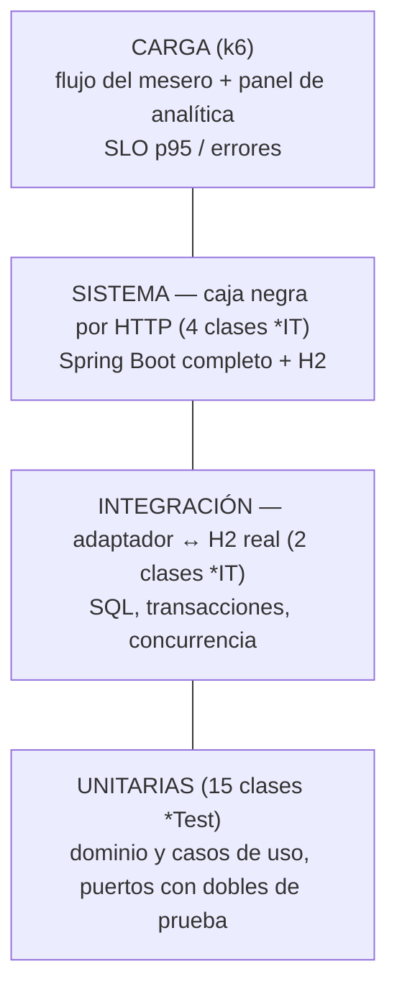

# Estrategia y resultados de pruebas — Corte 2

Todas las pruebas se ejecutan con un comando documentado:

| Qué | Comando | Reporte |
|---|---|---|
| Unitarias + regla de arquitectura + cobertura | `mvn test` | `target/surefire-reports/`, `target/site/jacoco/index.html` |
| Unitarias + integración + sistema (caja negra) | `mvn verify` | además `target/failsafe-reports/` |
| Carga | `powershell -ExecutionPolicy Bypass -File perf\run-perf.ps1` (o `bash perf/run-perf.sh`) | `perf/results/*.md` y `*.json` |
| Una sola clase | `mvn -Dtest=DivisionCuentaTest test` · `mvn -Dit.test=ApiInventarioIT verify` | |

Convención (igual que en los talleres): las clases `*Test` son unitarias y las corre Surefire en
`mvn test`; las clases `*IT` son de integración y las corre Failsafe en `mvn verify`.

---

## 1. Qué se prueba en cada nivel y por qué

| Nivel | Frontera de la hexagonal que cubre | Qué NO usa |
|---|---|---|
| Unitarias | Dentro del núcleo (dominio, casos de uso) | Base de datos, Spring, red, Swing |
| Integración | Puerto de salida ↔ adaptador JDBC ↔ base H2 | Spring, HTTP |
| Sistema | Adaptador REST ↔ casos de uso ↔ adaptadores JDBC ↔ H2 (todo junto) | Nada simulado |
| Carga | El sistema desplegado como jar, por HTTP | Nada simulado |

---

## 2. Pruebas unitarias

### 2.1 Inventario de clases

| Clase | Reto | Qué verifica | Dobles de prueba |
|---|---|---|---|
| `dominio/modelo/PedidoTest` (19) | base | Creación (límites de id/mesa), ítems, no dejar el pedido vacío, flujo de estados, cancelar, tiempos con reloj falso, notificaciones, reconstitución | `RelojFalso` (stub), `Notificador` (mock) |
| `dominio/modelo/ItemPedidoTest` (4) | base | Cantidad 1..50 (límites 0, 1, 50, 51), subtotal | – |
| `dominio/fabrica/PlatoFactoryTest` (6) | base | Tiempo por categoría, precio ≤ 0, nombre vacío/null, igualdad por nombre | – |
| `dominio/estado/EstadosPedidoTest` (3) | base | Nombre ↔ estado, estados terminales | – |
| `dominio/inventario/IngredienteTest` (9) | R1 | Descontar/reponer, stock exacto (límite), stock + 1, bajo mínimo (3, 4, 5 con mínimo 4), cruce del mínimo | – |
| `dominio/inventario/RecetaYConsumoTest` (8) | R1 | Consumo × porciones, suma de ingredientes compartidos, platos sin receta, orden fijo, porciones disponibles, política de devolución | – |
| `dominio/cuenta/RepartidorTest` (8) | R2 | 100.000 / 3, pesos 2:1, total 0, 1 persona, $1 entre 3, entradas inválidas | – |
| `dominio/cuenta/RepartidorPropiedadesTest` (2 propiedades × 500 casos) | R2 | **Propiedades** (jqwik): para cualquier total y 1..20 personas, las partes suman el total y difieren máximo en $1 | – |
| `dominio/cuenta/DivisionCuentaTest` (15) | R2 | Las tres estrategias, líneas sin asignar o inexistentes, porcentajes 99/101/0, propina 0..20 (límites −1 y 21), pedido cancelado o vacío, estrategia defectuosa detectada | – |
| `dominio/reportes/ReportesTest` (11) | R3 | Cada reporte sobre un escenario fijo, reportes vacíos, KPI, filtro de periodo (límite de 7 días), texto de Corte 1 | `RelojFalso` |
| `aplicacion/casodeuso/GestorPedidosTest` (21) | base, R1 | Mesa 0/1/10/11, mesa ocupada, plato inexistente, avanzar/cancelar terminados, orden reservar→guardar, **no guardar si no hay stock**, compensación si falla el guardado | Mocks de `PedidoRepositorio`, `MenuRepositorio`, `ControlInventario`, `Notificador` |
| `aplicacion/casodeuso/ServicioInventarioTest` (12) | R1 | Qué se descuenta y con qué motivo (captor), alerta solo al cruzar el mínimo, devolución vs merma, reposición, ajuste por conteo | Mocks de `InventarioRepositorio`, `AlertaInventario`; `ArgumentCaptor` |
| `aplicacion/casodeuso/ServicioCuentaTest` (3) | R2 | Pedido existente, inexistente, cancelado | Mock de `PedidoRepositorio` |
| `aplicacion/casodeuso/ServicioAnaliticaTest` (3) | R3 | Panel completo, filtro por periodo, reporte por id | Mock de `PedidoRepositorio` |
| `arquitectura/ReglasDeDependenciaTest` (3) | estilo | `dominio` y `aplicacion` no importan infraestructura, Spring, JDBC ni Swing | – |

Todas siguen **AAA** (comentarios `// Arrange`, `// Act`, `// Assert` en las que no son de una
línea) y usan `@DisplayName` en formato *Given / When / Then*.

### 2.2 Clases de equivalencia y valores límite (principales)

| Regla | Válidas | Inválidas | Límites probados |
|---|---|---|---|
| Mesa del pedido | 1..N mesas | ≤ 0, > N | 0, 1, 10, 11, −3 |
| Cantidad por línea | 1..50 | ≤ 0, > 50 | 0, 1, 49, 50, 51 |
| Precio del plato | > 0 | ≤ 0 | −1, 0, 1 |
| Descontar stock | 1..stock | ≤ 0, > stock | 0, −5, stock, stock + 1 |
| Alerta de stock | stock < mínimo | stock ≥ mínimo | mínimo − 1, mínimo, mínimo + 1, 0 |
| Personas en la cuenta | 1..20, nombres únicos | 0, 21, repetidos, vacíos | 0, 1, 20, 21 |
| Porcentajes | enteros 1..100 que suman 100 | suma 99/101, un 0 | 100 a una persona |
| Propina | 0..20 % | < 0, > 20 | −1, 0, 20, 21 |
| Quitar línea | 0..tamaño − 1 y queda ≥ 1 línea | −1, tamaño, única línea | −1, 2 (con 2 líneas), 0 (con 1) |
| Periodo SEMANA | desde hace 6 días a las 00:00 | antes | 22/09 00:00 (entra), 21/09 23:59 (no entra) |

### 2.3 Cobertura

JaCoCo mide el **núcleo** (`dominio` y `aplicacion`); UI Swing y arranque se excluyen porque no
contienen reglas de negocio. El `pom.xml` hace **fallar el build si la cobertura de líneas del
núcleo baja de 80 %**. Reporte: `target/site/jacoco/index.html` (se sube también como artefacto
del CI).

---

## 3. Pruebas de integración y de sistema

| Clase | Tipo | Frontera | Casos principales |
|---|---|---|---|
| `persistencia/PedidoRepositorioJdbcIT` (6) | Integración | `PedidoRepositorio` ↔ JDBC ↔ H2 | Guardar/leer con líneas y horas, actualizar estado, reemplazar líneas, activo por mesa, listar, secuencia |
| `persistencia/InventarioRepositorioJdbcIT` (7) | Integración | `InventarioRepositorio` ↔ JDBC ↔ H2 | Descuento con trazabilidad, **todo o nada**, descontar hasta 0, entrada y merma, `CHECK stock >= 0`, recetas, **40 hilos por 1 huevo con 10 en stock → exactamente 10 ventas** |
| `rest/ApiPedidosIT` (5) | Sistema (caja negra) | HTTP → REST → casos de uso → JDBC → H2 | Carta, **flujo completo crear → Entregado**, mesa ocupada 409, errores 400/404, cancelar dos veces 409 |
| `rest/ApiInventarioIT` (6) | Sistema | idem + inventario | Venta descuenta y queda trazada por pedido, cancelar en *Creado* devuelve, en preparación registra merma, **sin stock → 409 y no se crea el pedido**, reposición, alertas |
| `rest/ApiDivisionCuentaIT` (4) | Sistema | idem + cuenta | Las tres formas de dividir sobre un pedido real, rechazos 400 y 409 |
| `rest/ApiAnaliticaIT` (2) | Sistema | idem + analítica | Pedidos por HTTP reflejados en KPI y reportes, parámetros inválidos |

**Reproducibles y aisladas:** las pruebas de repositorio crean una base H2 **nueva con nombre
aleatorio** por prueba (`BaseDeDatosH2`); las de sistema usan una base por clase y la dejan como
recién arrancada antes de cada prueba (`LimpiadorBD` + `DatosIniciales`). No dependen del orden.

---

## 4. Pruebas de carga

Plan, SLO, escenarios y comandos: [`../perf/README.md`](../perf/README.md). Resumen:

| Script | Reto | Tipos | SLO |
|---|---|---|---|
| `flujo_pedidos_k6.js` | R1 + R2 + concurrencia | baseline, carga, estrés, pico | p95 ≤ 500 ms (crear ≤ 500, avanzar/dividir ≤ 300), errores < 1 %, checks > 99 % |
| `analitica_k6.js` | R3 | baseline (antes de cargar pedidos), carga (después) | p95 ≤ 500 ms, errores < 1 % |

---

## 5. Pruebas opcionales (bonificación)

No se presentan pruebas de UI con Selenium/Cypress: la interfaz es Swing de escritorio y esas
herramientas trabajan sobre navegador. Queda registrado como límite en
[arquitectura.md §7](arquitectura.md#7-límites-conocidos-y-trabajo-para-el-corte-3).

---

## 6. Resultados

> **Cómo completar esta sección:** ejecute los comandos y pegue aquí los números. Los archivos
> `perf/results/*.md` ya salen con el formato de tabla listo para copiar.

### 6.1 Unitarias e integración

| Suite | Pruebas | Fallidas | Evidencia |
|---|---|---|---|
| `mvn test` (unitarias) | _completar con la salida de Maven_ | | `target/surefire-reports/` |
| `mvn verify` (integración y sistema) | _completar_ | | `target/failsafe-reports/` |
| Cobertura de líneas del núcleo (JaCoCo) | _completar %_ | | `target/site/jacoco/index.html` |

### 6.2 Carga

| Escenario | Throughput (req/s) | p95 total (ms) | p95 crear pedido (ms) | Errores | ¿Cumple SLO? |
|---|---|---|---|---|---|
| flujo baseline (10 VUs) | | | | | |
| flujo carga (50 VUs) | | | | | |
| flujo estrés / pico (opcional) | | | | | |
| analítica baseline, antes (≈180 pedidos) | | | – | | |
| analítica carga, después (miles de pedidos) | | | – | | |

### 6.3 Análisis (guía para interpretar lo medido)

Contraste los resultados con las hipótesis que se escribieron **antes** de ejecutar
([`perf/README.md` §6](../perf/README.md#6-hipótesis-de-cuello-de-botella-escritas-antes-de-medir)):

1. **¿El p95 de la analítica subió entre "antes" y "después"?** Si subió en proporción al número de
   pedidos, el cuello de botella es el cálculo O(n) de `ServicioAnalitica` (lee todos los pedidos
   con sus líneas). La arquitectura lo mitiga sin tocar el dominio: un adaptador de lectura con
   agregados precalculados (CQRS) detrás de un puerto nuevo.
2. **¿`crear_pedido` es el endpoint más lento del flujo?** Es la única operación que abre la
   transacción de inventario; con muchos VUs, los pedidos que comparten ingredientes esperan el
   candado de fila. Si además `hikaricp.connections.pending` > 0 en `actuator-hikari-pending-*.json`,
   el pool de 20 conexiones también limita.
3. **Consistencia:** el `teardown` de k6 imprime "0 con stock negativo" y el check "cuenta dividida
   y cuadra al peso" debe estar en 100 %: bajo carga, las reglas de R1 y R2 se mantienen.
